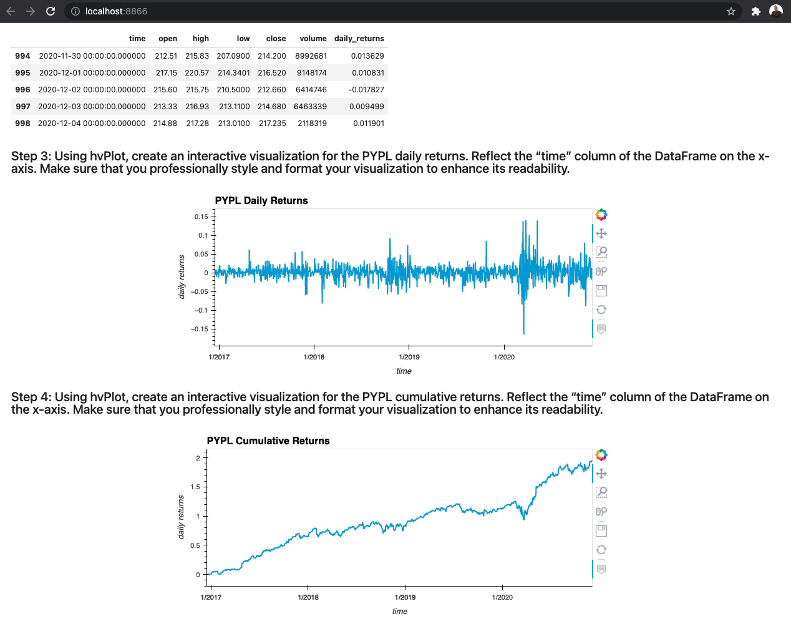

# ETF_Analyzer
An ETF Analyzer Tool

A Jupyter notebook building a financial database and web application by using SQL, Python, and the Voilà library to analyze the performance of a hypothetical fintech ETF.

Please be sure to install all the prerequisites (libraries) before running the program:

- `pip install pandas`
- `pip install hvplot.pandas`
- `pip install sqlalchemy`

The other libraries, **json, requests, and os** should be installed by default. If not, run the same *pip install "libraby name"* command.

After completing the prereq, run the [etf_analyzer.ipynb](etf_analyzer.ipynb) notebook. See following screenshots as example outputs of the Web Application using Voilà:

